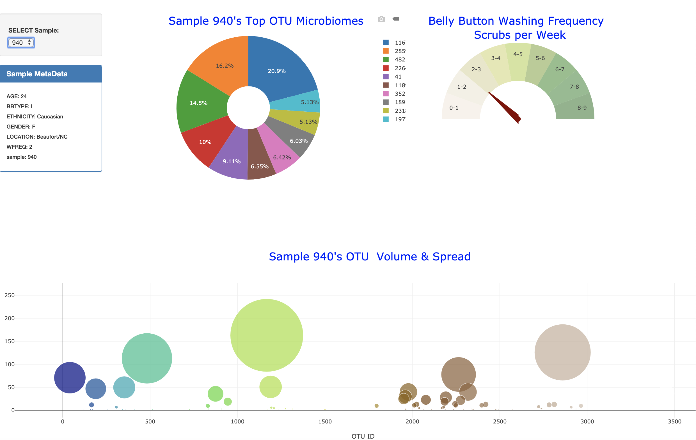

# Belly Button Biodiversity

This project is to build an interactive dashboard to explore the [Belly Button Biodiversity DataSet](http://robdunnlab.com/projects/belly-button-biodiversity/).

## Step 1 - Plotly.js

Plotly.js was utilizied to build interactive charts for the dashboard.

* PIE chart was created from the data from samples route (`/samples/<sample>`) to display the top 10 samples.

  * `sample_values` as the values for the PIE chart.

  * `otu_ids` as the labels for the pie chart.

  * `otu_labels` as the hovertext for the chart.

* A Bubble Chart was created from the data from samples route (`/samples/<sample>`) to display each sample.

  * `otu_ids` for the x values.

  * `sample_values` for the y values.

  * `sample_values` for the marker size.

  * `otu_ids` for the marker colors.

  * `otu_labels` for the text values.

* A Gauge Chart was created to plot the Weekly Washing Frequency obtained from the `/metadata/<sample>`route.

* Display the sample metadata from the route `/metadata/<sample>`

  * Display each key/value pair from the metadata JSON object somewhere on the page.

* Update all of the plots any time that a new sample is selected.

## Step 2 - Heroku
App was deployed in Heroku.
Click here to navigate to the app: [Belly-Biodiv](https://belly-biodiv.herokuapp.com/)

## Flask API

Flask API starter code provides the data needed for the plots.

